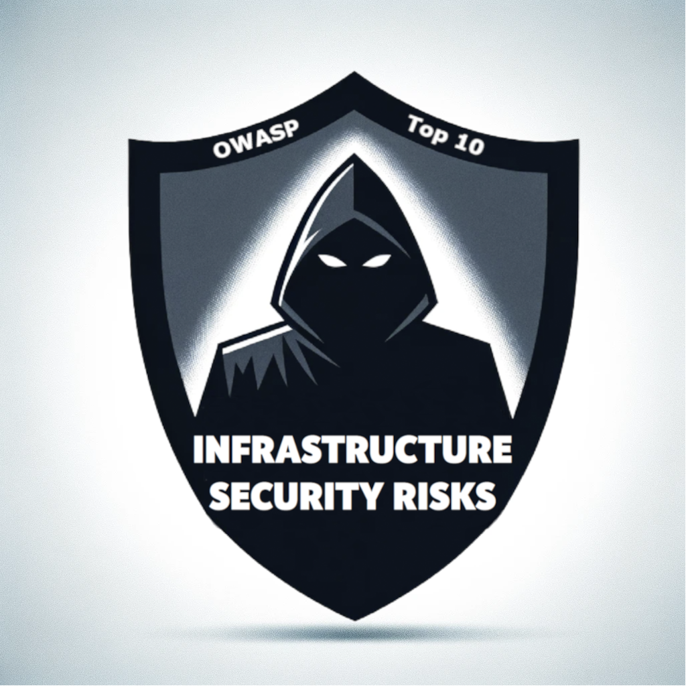

# Introduction

## Welcome to the OWASP Top 10 Infrastructure Security Risks - 2024

{:class="img-responsive"}

The OWASP Top 10 Infrastructure Security Risks shall provide information about the top Infrastructure Security Risks, Risks and Vulnerabilities.

## Motivation - Why is the OWASP Top 10 Infrastructure Security Risks important?

This OWASP Project aims to raise awareness and provide quality information regarding Infrastructure Security Risks, Threats and Vulnerabilities.
Infrastructure Security Risks play an essential role in information security.
After initial access, these vulnerabilities are the leading cause of compromising whole companies and organizations. Even though these Threats play an important role in the cyber kill chain, they are often overlooked by companies and organizations because the attack vectors originate from the inside and not outside.
Companies and organizations have to keep in mind that a defense line only to the outside isn't enough. If an attacker is able to get through this line of defense or around, e.g. via Phishing, and gets an initial pivot point, internal defense mechanisms are mandatory. Especially Threat Detection and Monitoring are needed to identify internal attacks and threat actors.
These are the reasons why this project came to life. We want to provide useful and quality information and raise awareness about these threats in general to improve the internal security of companies and organizations worldwide.

## Open Call for Data, Next Version and Contribution

To further improve the quality and significance of the OWASP Top 10 Infrastructure Security Risks, we kindly invite you to join our Open Call for Data for 2024 and 2025.
There, you can donate data, anonymously or publicly, to the Project. In the course of 2024 and 2025, we will collect all the data and then process it for 2026.
This way, we plan to publish the OWASP Top 10 Infrastructure Security Risks - Version 2026 using an even more extensive dataset and further improve the quality and significance.
Contributors and donors will be listed as sponsors, if they wish so, on the related project pages.
We also plan on doing CVE and CWE research for vulnerabilities regarding Infrastructure Security Risks.
For more information and how to contribute, please follow this [link](./INT_2024-Open_Call_for_Data.md).
